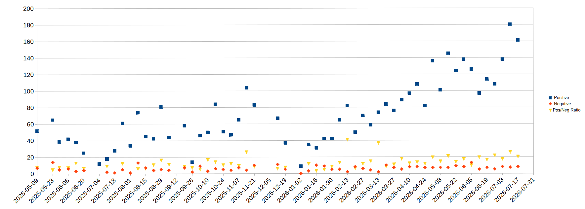
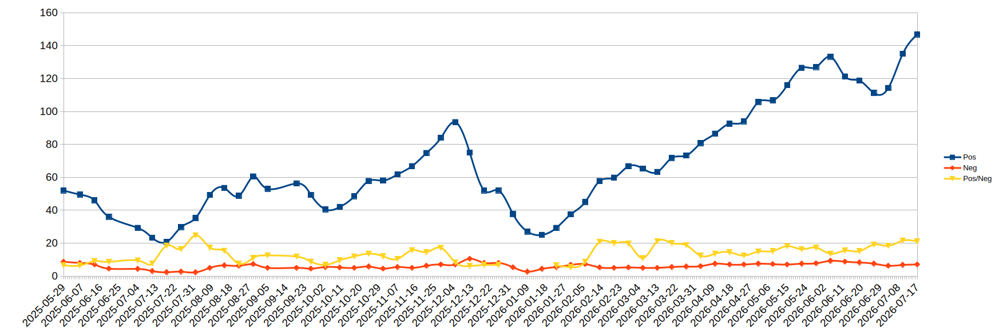

---
# Feel free to add content and custom Front Matter to this file.
# To modify the layout, see https://jekyllrb.com/docs/themes/#overriding-theme-defaults

layout: default
---

# Overview

In the middle of 2025, a few Starkville citizens got together and 
started protesting weekly on Fridays at noon. 
Almost every week since, there have been at least a few gathered to 
continue the expression of discontent. 
Whether or not you agree with the method, those participating
feel a bigger sense of community as a result. 

I joined for my own personal reasons and kept coming every week. 
My analytical background led me to start tracking the "positive" 
and "negative" responses we were getting, which eventually led to 
the data you can see below and this website. 
For some nuance on the data, please see footnote 2 on [this page](why).

I plan to update this website over time.  
Information is currently posted in various spaces on 
social media, but you likely found this website through 
something like that anyways. 

[Facebook (Fed Up Friday Starkville)](https://www.facebook.com/groups/848148657701471)

If you want to message the manager of this site directly, the email is [starkvilleweeklyprotests@gmail.com](mailto:starkvilleweeklyprotests@gmail.com).

## Short "articles" for more info
- [Don't just sit there; DO SOMETHING!](/do_something)
- ["Are you okay?"](/are_you_okay)
- [What is this site about?](/about)
- [Why?](/why)

# Historical Interaction Data

| Date       | Positive | Negative | Pos/Neg Ratio |
|-------|--------|---------| --------- |
| 2025-05-09 | 52       | 7        | 7.4           |
| 2025-05-23 | 65       | 14       | 4.6           |
| 2025-05-29 | 39       | 5        | 7.8           |
| 2025-06-06 | 42       | 6        | 7.0           |
| 2025-06-13 | 38       | 3        | 12.7          |
| 2025-06-20 | 25       | 4        | 6.3           |
| 2025-07-04 | 12       | ?        | n/a           |
| 2025-07-11 | 18       | 2        | 9.0           |
| 2025-07-18 | 28       | 1        | 28.0          |
| 2025-07-25 | 61       | 5        | 12.2          |
| 2025-08-01 | 34       | 1        | 34.0          |
| 2025-08-08 | 74       | 13       | 5.7           |
| 2025-08-15 | 45       | 7        | 6.4           |
| 2025-08-22 | 42       | 4        | 10.5          |
| 2025-08-29 | 81       | 5        | 16.2          |
| 2025-09-05 | 44       | 4        | 11.0          |
| 2025-09-19 | 58       | 7        | 8.3           |
| 2025-09-26 | 14       | 2        | 7.0           |
| 2025-10-03 | 46       | 9        | 5.1           |
| 2025-10-10 | 50       | 3        | 16.7          |
| 2025-10-24 | 51       | 5        | 10.2          |
| 2025-10-31 | 47       | 4        | 11.8          |
| 2025-11-07 | 65       | 7        | 9.3           |
| 2025-11-14 | 104      | 4        | 26.0          |
| 2025-11-21 | 83       | 10       | 8.3           |
| 2025-11-28 | n/a      | n/a      | n/a           |
| 2025-12-05 | n/a      | n/a      | n/a           |
| 2025-12-12 | 67       | 11       | 6.1           |
| 2025-12-19 | 37       | 5        | 7.4           |
| 2025-12-26 | n/a      | n/a      | n/a           |
| 2026-01-02 | 9        | 0        | ∞             |
| 2026-01-09 | 35       | 3        | 11.7          |
| 2026-01-16 | 31       | 10       | 3.1           |
| 2026-01-23 | 42       | 9        | 4.7           |
| 2026-01-30 | 42       | 5        | 8.4           |
| 2026-02-06 | 65       | 5        | 13.0          |
| 2026-02-13 | 82       | 2        | 41.0          |
| 2026-02-20 | 50       | 8        | 6.3           |
| 2026-02-27 | 70       | 6        | 11.7          |
| 2026-03-06 | 59       | 4        | 14.8          |
| 2026-03-13 | 74       | 2        | 37.0          |
| 2026-03-20 | 84       | 10       | 8.4           |
| 2026-03-27 | 76       | 7        | 10.9          |
| 2026-04-03 | 89       | 5        | 17.8          |
| 2026-04-10 | 97       | 8        | 12.1          |
| 2026-04-17 | 108      | 8        | 13.5          |
| 2026-04-24 | 82       | 7        | 11.7          |
| 2026-05-01 | 136      | 7        | 19.4          |
| 2026-05-08 | 101      | 7        | 14.4          |
| 2026-05-15 | 145      | 7        | 20.7          |
| 2026-05-22 | 124      | 9        | 13.8          |
| 2026-05-29 | 138      | 8        | 17.3          |
| 2026-06-05 | 126      | 13       | 9.7           |
| 2026-06-12 | 97       | 5        | 19.4          |
| 2026-06-19 | 114      | 7        | 16.3          |
| 2026-06-26 | 108      | 5        | 21.6          |
| 2026-07-03 | 138      | 8        | 17.3          |
| 2026-07-10 | 180      | 7        | 25.7          |
| 2026-07-17 | 161      | 8        | 20.1          |

## Scatter plot

## Smoothed line plot (averaged over three data points)

